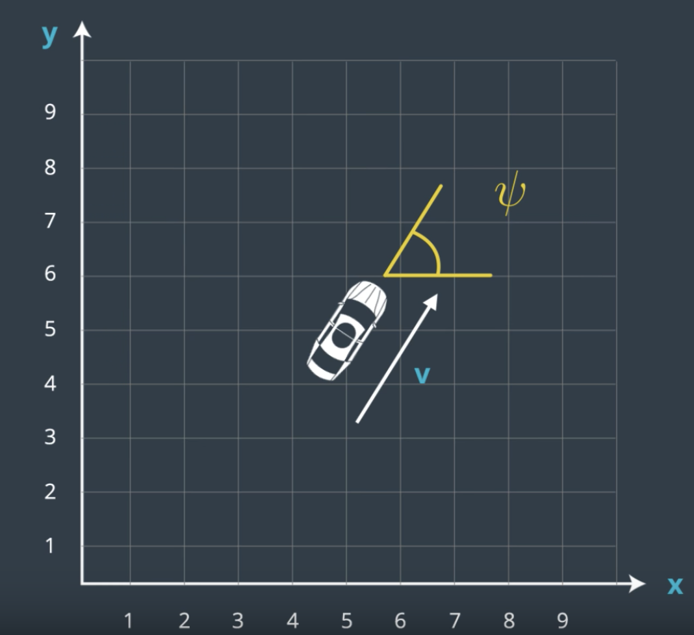
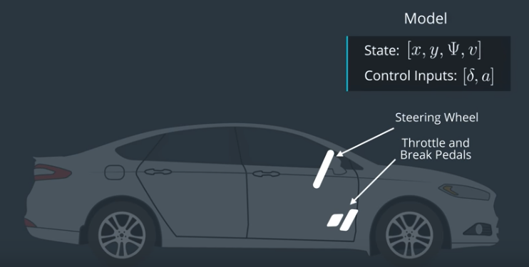
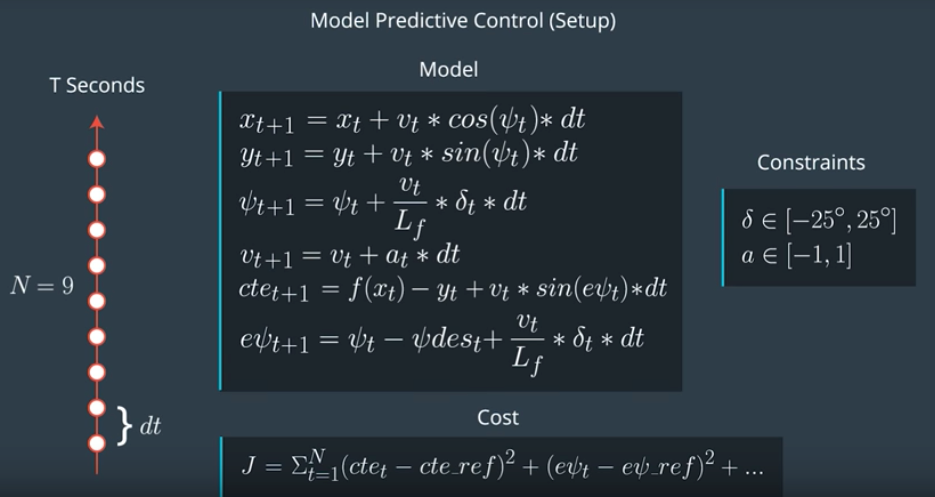
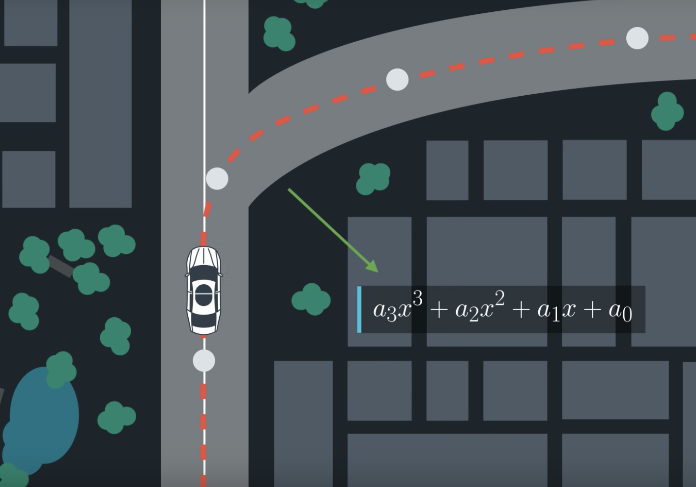

# CarND-Controls-MPC
Self-Driving Car Engineer Nanodegree Program

---

## Model Car State

* x
* y
* psi
* v

however to apply effect into our state, we have two actuator which are
steering and throttle(break)

* steering
* throttle






## Model Predictive Control

### Setup 


### The Data Provided From Vehicle
six way points (5 in front, 1 near the vehicle), the vehicle x, y map position,
 orientation and speed has been provided by vehicle.
 
Based on those six way points, we fit the polynomial for 3 order 




### The Next State (Predicted State)
Based on above state, we could predict next state by below method

```c
// Lf measures the distance between the front of the vehicle and its center of gravity. The larger the vehicle, the slower the turn rate.
const double Lf = 2;

x_[t+1] = x[t] + v[t] * cos(psi[t]) * dt
y_[t+1] = y[t] + v[t] * sin(psi[t]) * dt
psi_[t+1] = psi[t] + v[t] / Lf * delta[t] * dt
v_[t+1] = v[t] + a[t] * dt
cte[t+1] = f(x[t]) - y[t] + v[t] * sin(epsi[t]) * dt
epsi[t+1] = psi[t] - psides[t] + v[t] * delta[t] / Lf * dt
```

### Parameters T/N and dt
T should be as large as possible, while dt should be as small as possible.
If car driving 100KM/H, T = 1 seconds means 27 meters away, I think 20 to 35 meters 
would be a good range to keep. After trial and error, I have setup T as 0.8 seconds.

Once T has been set, next one is how many way points we'd like to add. Bigger N will
 makes it easier to accurately approximate a continuous reference trajectory, but 
 adds more computation, after tried in simulate, 10 is a good size.
 
dt would be simple at this moment now, we simple use T divide by N

```cplusplus
double T = 0.8;
size_t N = 10;
double dt = T/N;
```


### Cost 

We split cost into two parts:
* State: Keep car in track and keep going, we penalize car from CTE, orientation and have to keep a speed of reference velocity
in our case it's 80MPH

* Control Input: penalise the magnitude of the input as well as the change rate, so that 
add some temporal smoothness. we apply 20 times more penalise to big steering angle
 and accelerate so that car won't experience sudden move or turn, 
 also apply 2000 times of the penalise for difference between the next steering angle input 
 and the current one so car feels far more smoothness


```c
AD<double> totalCost(const ADvector& vars) {
  AD<double> cost = 0.0;

  // The part of the cost based on the reference state.
  for (int t = 0; t < N; t++) {
    cost += CppAD::pow(vars[cte_start + t], 2);
    cost += 20*CppAD::pow(vars[epsi_start + t], 2);
    cost += CppAD::pow(vars[v_start + t] - ref_v, 2);
  }

  // Minimize the use of actuators.
  for (int t = 0; t < N - 1; t++) {
    cost += 20*CppAD::pow(vars[delta_start + t], 2);
    cost += 20*CppAD::pow(vars[a_start + t], 2);
  }

  // Minimize the value gap between sequential actuations.
  for (int t = 0; t < N - 2; t++) {
    cost += 2000*CppAD::pow(vars[delta_start + t + 1] - vars[delta_start + t], 2);
    cost += CppAD::pow(vars[a_start + t + 1] - vars[a_start + t], 2);
  }

  return cost;
}
```

### Handle the latency

In a real car, an actuation command won't execute instantly - there will be a delay 
as the command propagates through the system. A realistic delay might be on the order 
of 100 milliseconds.

We could model this latency into our state. before every MPC resolve, we modify the state 
to add delayed information in as below.

```c
const double delay = 100 / 1000.0;
const double Lf = 2.67;
const double cte = -polyeval(coeffs, 0);
const double epsi = -atan(coeffs[1]);

double x_delay = 0 + ( velocity * delay );
double y_delay = 0;
double psi_delay = 0 - ( velocity * steering_angle * delay / Lf );
double v_delay = velocity + throttle * delay;
double cte_delay = cte + ( velocity * sin(epsi) * delay );
double epsi_delay = epsi - ( velocity * atan(coeffs[1]) * delay / Lf );

// Define the state vector.
Eigen::VectorXd state(6);
state << x_delay, y_delay, psi_delay, v_delay, cte_delay, epsi_delay;
```

## Dependencies

* cmake >= 3.5
 * All OSes: [click here for installation instructions](https://cmake.org/install/)
* make >= 4.1(mac, linux), 3.81(Windows)
  * Linux: make is installed by default on most Linux distros
  * Mac: [install Xcode command line tools to get make](https://developer.apple.com/xcode/features/)
  * Windows: [Click here for installation instructions](http://gnuwin32.sourceforge.net/packages/make.htm)
* gcc/g++ >= 5.4
  * Linux: gcc / g++ is installed by default on most Linux distros
  * Mac: same deal as make - [install Xcode command line tools]((https://developer.apple.com/xcode/features/)
  * Windows: recommend using [MinGW](http://www.mingw.org/)
* [uWebSockets](https://github.com/uWebSockets/uWebSockets)
  * Run either `install-mac.sh` or `install-ubuntu.sh`.
  * If you install from source, checkout to commit `e94b6e1`, i.e.
    ```
    git clone https://github.com/uWebSockets/uWebSockets
    cd uWebSockets
    git checkout e94b6e1
    ```
    Some function signatures have changed in v0.14.x. See [this PR](https://github.com/udacity/CarND-MPC-Project/pull/3) for more details.

* **Ipopt and CppAD:** Please refer to [this document](https://github.com/udacity/CarND-MPC-Project/blob/master/install_Ipopt_CppAD.md) for installation instructions.
* [Eigen](http://eigen.tuxfamily.org/index.php?title=Main_Page). This is already part of the repo so you shouldn't have to worry about it.
* Simulator. You can download these from the [releases tab](https://github.com/udacity/self-driving-car-sim/releases).
* Not a dependency but read the [DATA.md](./DATA.md) for a description of the data sent back from the simulator.


## Basic Build Instructions

1. Clone this repo.
2. Make a build directory: `mkdir build && cd build`
3. Compile: `cmake .. && make`
4. Run it: `./mpc`.

## Tips

1. It's recommended to test the MPC on basic examples to see if your implementation behaves as desired. One possible example
is the vehicle starting offset of a straight line (reference). If the MPC implementation is correct, after some number of timesteps
(not too many) it should find and track the reference line.
2. The `lake_track_waypoints.csv` file has the waypoints of the lake track. You could use this to fit polynomials and points and see of how well your model tracks curve. NOTE: This file might be not completely in sync with the simulator so your solution should NOT depend on it.
3. For visualization this C++ [matplotlib wrapper](https://github.com/lava/matplotlib-cpp) could be helpful.)
4.  Tips for setting up your environment are available [here](https://classroom.udacity.com/nanodegrees/nd013/parts/40f38239-66b6-46ec-ae68-03afd8a601c8/modules/0949fca6-b379-42af-a919-ee50aa304e6a/lessons/f758c44c-5e40-4e01-93b5-1a82aa4e044f/concepts/23d376c7-0195-4276-bdf0-e02f1f3c665d)
5. **VM Latency:** Some students have reported differences in behavior using VM's ostensibly a result of latency.  Please let us know if issues arise as a result of a VM environment.

## Editor Settings

We've purposefully kept editor configuration files out of this repo in order to
keep it as simple and environment agnostic as possible. However, we recommend
using the following settings:

* indent using spaces
* set tab width to 2 spaces (keeps the matrices in source code aligned)

## Code Style

Please (do your best to) stick to [Google's C++ style guide](https://google.github.io/styleguide/cppguide.html).

## Project Instructions and Rubric

Note: regardless of the changes you make, your project must be buildable using
cmake and make!

More information is only accessible by people who are already enrolled in Term 2
of CarND. If you are enrolled, see [the project page](https://classroom.udacity.com/nanodegrees/nd013/parts/40f38239-66b6-46ec-ae68-03afd8a601c8/modules/f1820894-8322-4bb3-81aa-b26b3c6dcbaf/lessons/b1ff3be0-c904-438e-aad3-2b5379f0e0c3/concepts/1a2255a0-e23c-44cf-8d41-39b8a3c8264a)
for instructions and the project rubric.

## Hints!

* You don't have to follow this directory structure, but if you do, your work
  will span all of the .cpp files here. Keep an eye out for TODOs.

## Call for IDE Profiles Pull Requests

Help your fellow students!

We decided to create Makefiles with cmake to keep this project as platform
agnostic as possible. Similarly, we omitted IDE profiles in order to we ensure
that students don't feel pressured to use one IDE or another.

However! I'd love to help people get up and running with their IDEs of choice.
If you've created a profile for an IDE that you think other students would
appreciate, we'd love to have you add the requisite profile files and
instructions to ide_profiles/. For example if you wanted to add a VS Code
profile, you'd add:

* /ide_profiles/vscode/.vscode
* /ide_profiles/vscode/README.md

The README should explain what the profile does, how to take advantage of it,
and how to install it.

Frankly, I've never been involved in a project with multiple IDE profiles
before. I believe the best way to handle this would be to keep them out of the
repo root to avoid clutter. My expectation is that most profiles will include
instructions to copy files to a new location to get picked up by the IDE, but
that's just a guess.

One last note here: regardless of the IDE used, every submitted project must
still be compilable with cmake and make./

## How to write a README
A well written README file can enhance your project and portfolio.  Develop your abilities to create professional README files by completing [this free course](https://www.udacity.com/course/writing-readmes--ud777).
